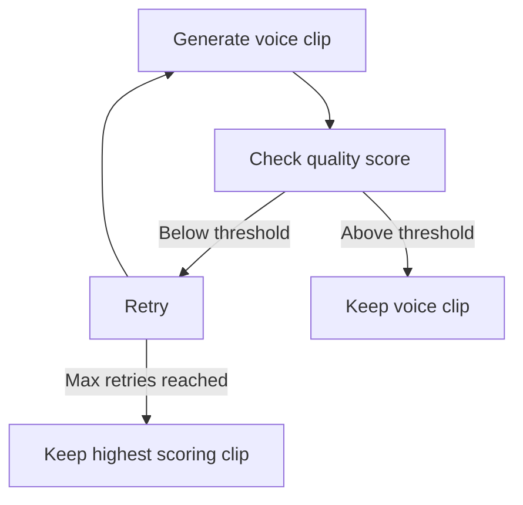

# README.md

## Voice Generation with Quality Threshold

This Python script generates voice clips using the [BARK](https://github.com/suno-ai/bark) library and [Whisper](https://github.com/openai/whisper) voice recognition model, ensuring the generated voices meet a specified quality threshold. The script `create_all.py`:

- Processes CSV files containing phrases
- Generates voice clips for each phrase
- Checks their quality using a voice recognition model along with phonetics.

If the generated voice clip does not meet the quality threshold, the script retries until it reaches the maximum number of retries or finds a satisfactory voice clip. If a satisfactory voice clip is not produced, the highest scoring clip will be kept



### Dependencies

- bark_ssg==1.3.4
- fuzzywuzzy==0.18.0
- num2words==0.5.10
- numpy==1.20.3
- openai_whisper==20230314
- pydub==0.25.1
- pyphonetics==0.5.3
- scipy==1.7.3
- simpleaudio==1.0.4

### Installing Dependencies

To install the required dependencies, run the following command:

```bash
pip install -r requirements.txt
```

### Usage

1. Save all your desired voice clips in a csv. Each row should follow this convention `file_name.wav;This is the phrase I want to hear`. You can check the `Templates`folders in this repo for examples.
For every row in the csv the script will generate a file in the same folder.
1. Make sure that no soundfiles are already present, if they are, the script will evaluate that sound file instead. This is benefitial for reruns but if you are converting from one voice to another it will cause issues since the current file will be kept.
1. Open `create_all.py`. Set the working folder path in the `workfolder` variable. It should be the top folder of all csv-files. All subdirectories regardless of how deep they are nested will be searched by the script. *Windows users: Change backslash in the path to forward-slash*
2. Set the quality threshold in the `voice_threshold` variable (minimum score for a sound to be considered good enough; the maximum score is 100).
3. Set the maximum number of retries in the `max_retries` variable.
4. Choose whether to use phonetics for text comparison in the `use_phonetics` variable (currently only works for English).
5. Choose whether to keep files that failed to generate in the `keep_failed_files` variable.
6. Run the script.

### How it Works

1. The script loads the Whisper voice recognition model.
2. It loads the BARK voice generation models.
3. It finds all CSV files in the specified working folder and combines their data into a list of tuples.
4. It creates or reuses an existing CSV file to store information about the generated voice clips.
5. For each phrase, the script generates a voice clip and checks its quality using the voice recognition model.
6. If the generated voice clip does not meet the quality threshold, the script retries until it reaches the maximum number of retries or finds a satisfactory voice clip.
7. It updates the information in the CSV file accordingly.

### Notes

- The script requires the BARK library, Whisper voice recognition model, and other dependencies listed in the `requirements.txt` file. Ensure that they are installed and configured correctly.
- Ensure that the working folder contains properly formatted CSV files with phrases to generate voice clips.
- The generated voice clips will be saved in the specified working folder, and the information about their quality will be stored in an `all_data.csvfile`.
